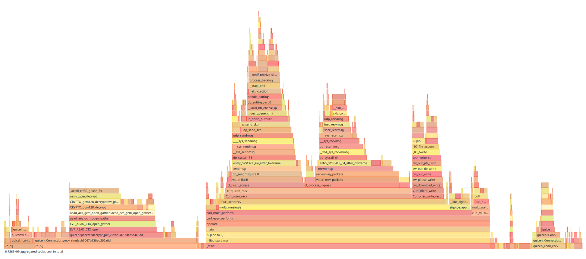
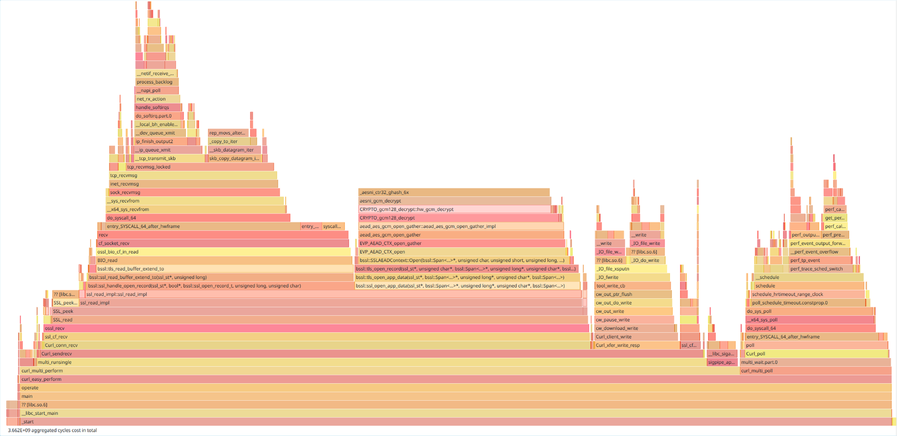

## Time spent in http3:

**Total**: 6.726e9 cycles

- **quiceh::Connection::recv_single**: 2.202e9 cycles (32.7%)
- **recvmmsg**: 8.811e8 cycles (13.1%)
- **sendmsg**: 8.039e8 cycles (12%)
- **sigpipe/sigagtion**: 3.977e8 cycles (5.91%)
- **Curl_xfer_write_resp**: 3.616e8 cycles (5.38%)
- **quiceh::Connection::send_single**: 1.828e8 cycles (2.72%)
- **poll**: 1.625e8 cycles (2.42%)

The 25% left are mostly rust functions that are not correctly referenced due to the link time optimization in quiceh.

Already, we can see that sendmsg is almost as costly as recvmmsg, even though we are only sending ack.  
Hopefully, we handle the ack quickly in quiceh::Connection::send_single compared to quiceh::Connection::recv_single.  
We definitely need delayed ack to shave around 12% of the total cost.

It's hard to count precisely, but we can see a lot of cycles spent on converting C objects to rust objects and vice-versa,
for example, only the ::from_bytes method takes 2.81% of the total time. My guess is that around 10% of the total time is spent for object conversions, something that we don't have in the http2 implementation.

## Time spent in http2

**Total**: 3.662e9 cycles

- **recv**: 1.032e9 cycles (28.2%)
- **tls crypto**: 9.275e8 cycles (25.3%)
- **poll**: 8.799e8 cycles (24%)
- **Curl_xfer_write_resp**: 3.511e8 cycles (9.59%)
- **sigpipe/sigaction**: 1.922e8 cycles (5.25%)

The 9% left are mostly copies

`recv` and the tls crypto does the same job as the combinaison of `quiceh::Connection::recv_single`, `recvmmsg`, `sendmsg` and `quiceh::Connection::send_single`.
However, the former uses only 2e9 cycles (and recv could be greatly optimized with recvmmsg) while the latter uses 4e9 cycles and this number is likely more 5e9 cycles if we include all the functions that are not correctly referenced but are likely part of the recv/send mechanism like `quiceh::packet::decrypt_hdr`.

For some reason sigpipe/sigaction takes way more time for http3, we may want to investigate that.

We also have poll taking way more time in http2, but this is probably linked to TCP.